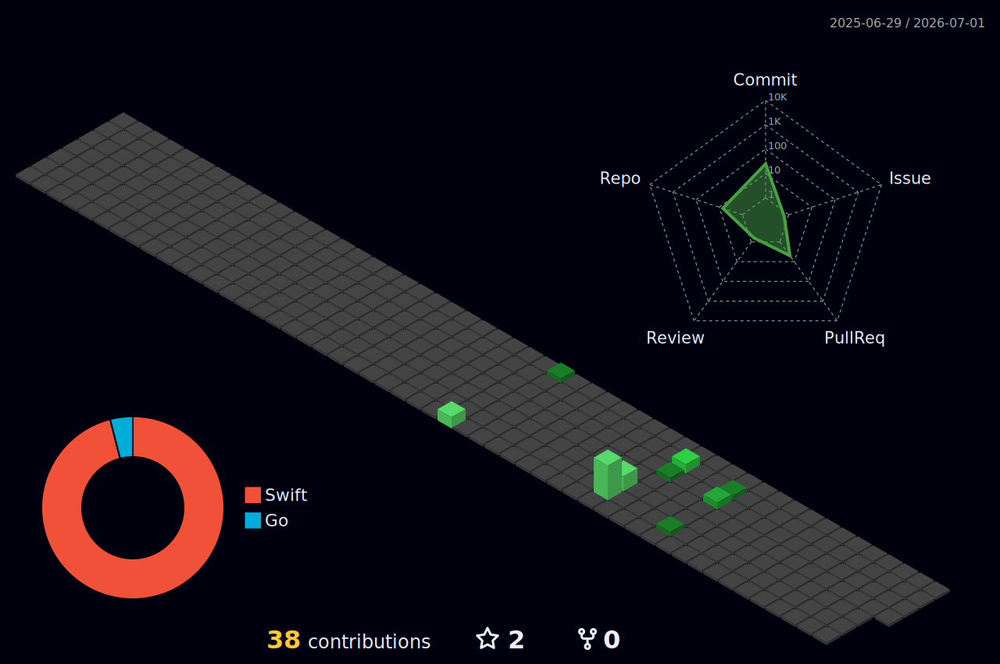

  

  

 

---

## 📊 GitHub Stats

  
  

  

  

## 🐍 Contribution Snake

  <picture>
    <source media="(prefers-color-scheme: dark)" srcset="https://raw.githubusercontent.com/zero9211/zero9211/output/github-snake-dark.svg" />
    <source media="(prefers-color-scheme: light)" srcset="https://raw.githubusercontent.com/zero9211/zero9211/output/github-snake.svg" />
    
  </picture>

## 📊 3D Contribution Graph

  

---

<!-- TRENDING-X-START -->

<h2>🐦 X (Twitter) 今日热议 Top 10</h2>

| # | 热门话题 | 讨论量 |
|:---:|:---|---:|
| 🥇 | [#AEWDynamite](https://twitter.com/search?q=%23AEWDynamite) | — |
| 🥈 | [#Survivor](https://twitter.com/search?q=%23Survivor) | — |
| 🥉 | [Jim Crow](https://twitter.com/search?q=Jim%20Crow) | — |
| 4️⃣ | [David Peterson](https://twitter.com/search?q=David%20Peterson) | — |
| 5️⃣ | [Kevin Knight](https://twitter.com/search?q=Kevin%20Knight) | — |
| 6️⃣ | [Supreme Court](https://twitter.com/search?q=Supreme%20Court) | — |
| 7️⃣ | [Scottie Barnes](https://twitter.com/search?q=Scottie%20Barnes) | — |
| 8️⃣ | [SCOTUS](https://twitter.com/search?q=SCOTUS) | — |
| 9️⃣ | [Ben Brown](https://twitter.com/search?q=Ben%20Brown) | — |
| 🔟 | [Anthony Mackie](https://twitter.com/search?q=Anthony%20Mackie) | — |

🕐 更新于 2026-04-30 09:58 CST &nbsp;·&nbsp; 数据来源: trends24.in
<!-- TRENDING-X-END -->

<!-- TRENDING-SUBSTACK-START -->

<h2>📰 Substack 热门文章 Top 10</h2>

> ⚠️ 暂时无法获取 Substack 热门数据，稍后重试

🕐 更新于 2026-04-30 09:58 CST &nbsp;·&nbsp; 数据来源: substack.com
<!-- TRENDING-SUBSTACK-END -->

<!-- TRENDING-GITHUB-START -->

<h2>⭐ GitHub 热门项目 Top 10</h2>

| # | 项目 | ⭐ Stars | 语言 | 简介 |
|:---:|:---|:---:|:---:|:---|
| 🥇 | [warpdotdev/warp](https://github.com/warpdotdev/warp) | 44345 | `Rust` | Warp is an agentic development environment, born out of the terminal. |
| 🥈 | [mattpocock/skills](https://github.com/mattpocock/skills) | 44963 | `Shell` | Skills for Real Engineers. Straight from my .claude directory. |
| 🥉 | [HunxByts/GhostTrack](https://github.com/HunxByts/GhostTrack) | 11608 | `Python` | Useful tool to track location or mobile number |
| 4️⃣ | [ComposioHQ/awesome-codex-skills](https://github.com/ComposioHQ/awesome-codex-skills) | 4833 | `Python` | A curated list of practical Codex skills for automating workflows across… |
| 5️⃣ | [1jehuang/jcode](https://github.com/1jehuang/jcode) | 1399 | `Rust` | Coding Agent Harness |
| 6️⃣ | [abhigyanpatwari/GitNexus](https://github.com/abhigyanpatwari/GitNexus) | 33365 | `TypeScript` | GitNexus: The Zero-Server Code Intelligence Engine - GitNexus is a clien… |
| 7️⃣ | [microsoft/VibeVoice](https://github.com/microsoft/VibeVoice) | 45719 | `Python` | Open-Source Frontier Voice AI |
| 8️⃣ | [CJackHwang/ds2api](https://github.com/CJackHwang/ds2api) | 2738 | `Go` | Deepseek to API: A lightweight, high-performance full-stack middleware c… |
| 9️⃣ | [obra/superpowers](https://github.com/obra/superpowers) | 173197 | `Shell` | An agentic skills framework & software development methodology that work… |
| 🔟 | [ZhuLinsen/daily_stock_analysis](https://github.com/ZhuLinsen/daily_stock_analysis) | 32820 | `Python` | LLM驱动的 A/H/美股智能分析器：多数据源行情 + 实时新闻 + LLM决策仪表盘 + 多渠道推送，零成本定时运行，纯白嫖. LLM-pow… |

🕐 更新于 2026-04-30 09:58 CST &nbsp;·&nbsp; 数据来源: github.com/trending
<!-- TRENDING-GITHUB-END -->

---

## 📈 Activity Graph

  

  

