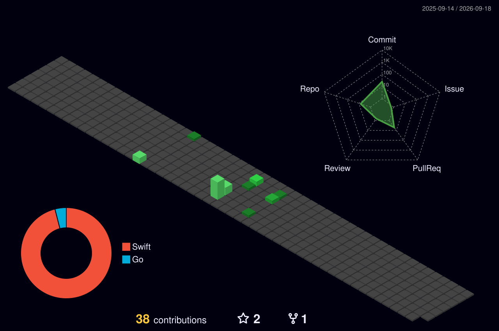

  

  

 

---

## 📊 GitHub Stats

  
  

  

  

## 🐍 Contribution Snake

  <picture>
    <source media="(prefers-color-scheme: dark)" srcset="https://raw.githubusercontent.com/zero9211/zero9211/output/github-snake-dark.svg" />
    <source media="(prefers-color-scheme: light)" srcset="https://raw.githubusercontent.com/zero9211/zero9211/output/github-snake.svg" />
    
  </picture>

## 📊 3D Contribution Graph

  

---

<!-- TRENDING-X-START -->

<h2>🐦 X (Twitter) 今日热议 Top 10</h2>

| # | 热门话题 | 讨论量 |
|:---:|:---|---:|
| 🥇 | [#AEWDynamite](https://twitter.com/search?q=%23AEWDynamite) | — |
| 🥈 | [Clippers](https://twitter.com/search?q=Clippers) | — |
| 🥉 | [Kawhi](https://twitter.com/search?q=Kawhi) | — |
| 4️⃣ | [Minneapolis](https://twitter.com/search?q=Minneapolis) | — |
| 5️⃣ | [Pablo](https://twitter.com/search?q=Pablo) | — |
| 6️⃣ | [Ballmer](https://twitter.com/search?q=Ballmer) | — |
| 7️⃣ | [Josh Alexander](https://twitter.com/search?q=Josh%20Alexander) | — |
| 8️⃣ | [Kofi](https://twitter.com/search?q=Kofi) | — |
| 9️⃣ | [So Anxious](https://twitter.com/search?q=So%20Anxious) | — |
| 🔟 | [Mark Davis](https://twitter.com/search?q=Mark%20Davis) | — |

🕐 更新于 2026-09-03 10:00 CST &nbsp;·&nbsp; 数据来源: trends24.in
<!-- TRENDING-X-END -->

<!-- TRENDING-SUBSTACK-START -->

<h2>📰 Substack 热门文章 Top 10</h2>

> ⚠️ 暂时无法获取 Substack 热门数据，稍后重试

🕐 更新于 2026-09-03 10:00 CST &nbsp;·&nbsp; 数据来源: substack.com
<!-- TRENDING-SUBSTACK-END -->

<!-- TRENDING-GITHUB-START -->

<h2>⭐ GitHub 热门项目 Top 10</h2>

| # | 项目 | ⭐ Stars | 语言 | 简介 |
|:---:|:---|:---:|:---:|:---|
| 🥇 | [fmtlib/fmt](https://github.com/fmtlib/fmt) | 24297 | `C++` | A modern formatting library |
| 🥈 | [google-research/timesfm](https://github.com/google-research/timesfm) | 29876 | `Python` | TimesFM (Time Series Foundation Model) is a pretrained time-series found… |
| 🥉 | [DietrichGebert/ponytail](https://github.com/DietrichGebert/ponytail) | 121679 | `JavaScript` | Makes your AI agent think like the laziest senior dev in the room. The b… |
| 4️⃣ | [debpalash/VoiceStudio](https://github.com/debpalash/VoiceStudio) | 14831 | `Python` | VoiceStudio is the open-source, fully-local ElevenLabs alternative — voi… |
| 5️⃣ | [sngyai/Sequoia-X](https://github.com/sngyai/Sequoia-X) | 6116 | `Python` | A股自动选股系统 — 多种技术形态自动扫描，收盘后自动运行并推送飞书 |
| 6️⃣ | [ChromeDevTools/chrome-devtools-mcp](https://github.com/ChromeDevTools/chrome-devtools-mcp) | 50663 | `TypeScript` | Chrome DevTools for coding agents |
| 7️⃣ | [NousResearch/hermes-agent](https://github.com/NousResearch/hermes-agent) | 240154 | `Python` | The agent that grows with you |
| 8️⃣ | [superlinked/sie](https://github.com/superlinked/sie) | 3080 | `Python` | Open-source inference server and production cluster for all the models y… |
| 9️⃣ | [pacifio/atlas](https://github.com/pacifio/atlas) | 2911 | `Rust` | Source control for agents. Use multiple coding agents, track their chang… |
| 🔟 | [zyronon/TypeWords](https://github.com/zyronon/TypeWords) | 9337 | `Vue` | Practice English, one strike, one step forward; 练习英语，一次敲击，一点进步； |

🕐 更新于 2026-09-03 10:00 CST &nbsp;·&nbsp; 数据来源: github.com/trending
<!-- TRENDING-GITHUB-END -->

---

## 📈 Activity Graph

  

  

