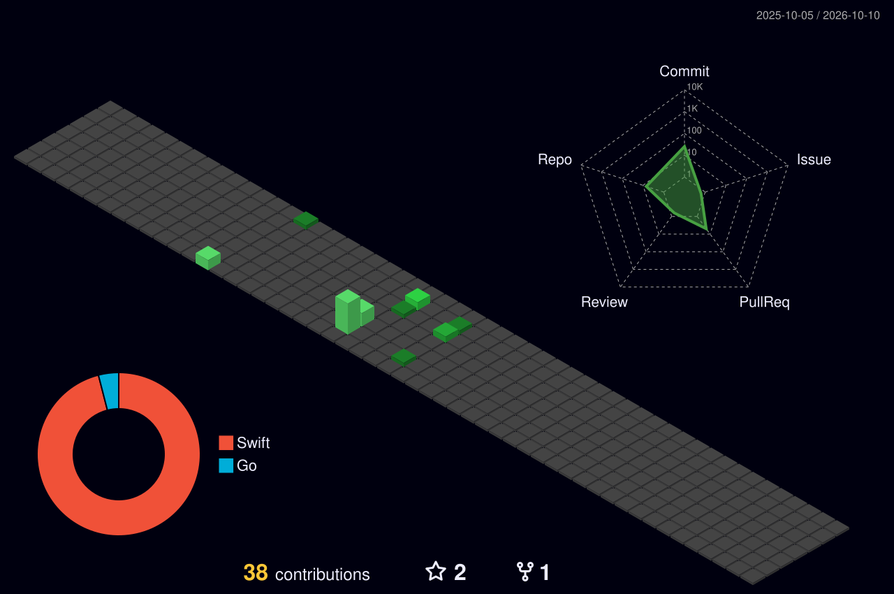

  

  

 

---

## 📊 GitHub Stats

  
  

  

  

## 🐍 Contribution Snake

  <picture>
    <source media="(prefers-color-scheme: dark)" srcset="https://raw.githubusercontent.com/zero9211/zero9211/output/github-snake-dark.svg" />
    <source media="(prefers-color-scheme: light)" srcset="https://raw.githubusercontent.com/zero9211/zero9211/output/github-snake.svg" />
    
  </picture>

## 📊 3D Contribution Graph

  

---

<!-- TRENDING-X-START -->

<h2>🐦 X (Twitter) 今日热议 Top 10</h2>

> ⚠️ 暂时无法获取 X 热门数据，稍后重试

🕐 更新于 2026-10-06 11:46 CST &nbsp;·&nbsp; 数据来源: trends24.in
<!-- TRENDING-X-END -->

<!-- TRENDING-SUBSTACK-START -->

<h2>📰 Substack 热门文章 Top 10</h2>

> ⚠️ 暂时无法获取 Substack 热门数据，稍后重试

🕐 更新于 2026-10-06 11:46 CST &nbsp;·&nbsp; 数据来源: substack.com
<!-- TRENDING-SUBSTACK-END -->

<!-- TRENDING-GITHUB-START -->

<h2>⭐ GitHub 热门项目 Top 10</h2>

| # | 项目 | ⭐ Stars | 语言 | 简介 |
|:---:|:---|:---:|:---:|:---|
| 🥇 | [tester-army/e2e](https://github.com/tester-army/e2e) | 4966 | `TypeScript` | Next generation e2e testing framework for web and mobile apps. |
| 🥈 | [thedotmack/claude-mem](https://github.com/thedotmack/claude-mem) | 96682 | `TypeScript` | Persistent Context Across Sessions for Every Agent – Captures everything… |
| 🥉 | [michael-denyer/pstack-claude](https://github.com/michael-denyer/pstack-claude) | 1445 | `JavaScript` | Claude Code, Codex, Copilot, Pi, OpenCode, Gemini, and Prime Agent versi… |
| 4️⃣ | [earthtojake/text-to-cad](https://github.com/earthtojake/text-to-cad) | 17499 | `Python` | Give your agent CAD superpowers. |
| 5️⃣ | [pingdotgg/t3code](https://github.com/pingdotgg/t3code) | 25657 | `TypeScript` | — |
| 6️⃣ | [boykopovar/AnyPS5](https://github.com/boykopovar/AnyPS5) | 5042 | `C++` | Tool for automatic PS5 executables porting to Linux and Windows |
| 7️⃣ | [Panniantong/Agent-Reach](https://github.com/Panniantong/Agent-Reach) | 92008 | `Python` | Give your AI agent eyes to see the entire internet. Read & search Twitte… |
| 8️⃣ | [calesthio/OpenMontage](https://github.com/calesthio/OpenMontage) | 64150 | `Python` | World's first open-source, agentic video production system. 12 productio… |
| 9️⃣ | [caddyserver/caddy](https://github.com/caddyserver/caddy) | 77196 | `Go` | Fast and extensible multi-platform HTTP/1-2-3 web server with automatic … |
| 🔟 | [DuarteSantos8/openGym](https://github.com/DuarteSantos8/openGym) | 4356 | `JavaScript` | Self-hosted gym & body-weight tracker — plan routines, log workouts (sup… |

🕐 更新于 2026-10-06 11:46 CST &nbsp;·&nbsp; 数据来源: github.com/trending
<!-- TRENDING-GITHUB-END -->

---

## 📈 Activity Graph

  

  

